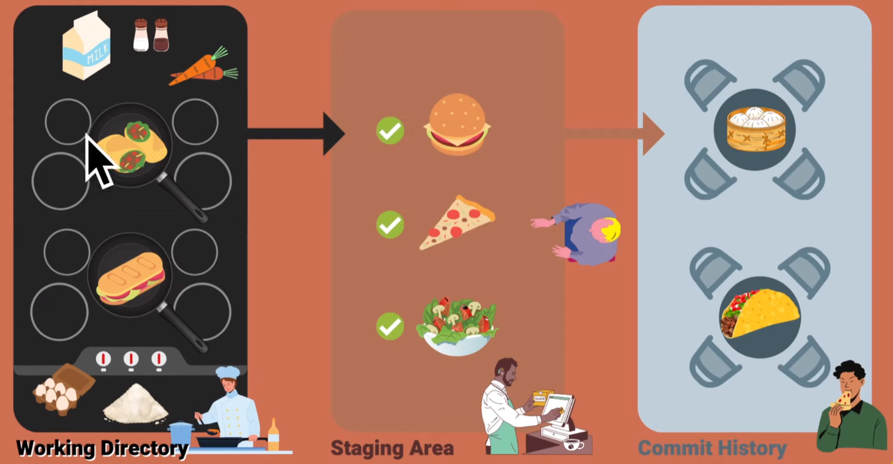

# Que es Git
Es un sistema de control de versiones distribuido, gratuito y open source.

_!!Qué sea **Open Source** no significa que sea **gratis**_

### Diferencia entre sistema de control de versiones distribuido y uno centralizado:
**Sistemas centralizados:** cuando se guarda todo el proyecto en un servidor centralizado para poder trabajar y enviar cambios en el software que se está programando. 

**Sistemas distribuidos:** cuando cada integrante del equipo mantiene una copia completa del proyecto localmente.

### Git Staging Area
Es un lugar dentro de _git, lo que ya este listo (_archivo nuevo o cambios a un archivo_) para realizar commit se pueda pasar! 

>
### Cómo crear un respositorio local y realizar el primer commit

- Inicializamos el control de versiones con `git init`
- Chequeamos el estado con `git status`
- Agregamos el Staging area con `git add <file>`
- Hacemos commit con `git commit -m "<mensaje>"`
- Revisamos el log del commit con `git log`

>
### Ramas **(Branch)** y uso del merge
 - `git branch <nombre-de-la-rama>` crea una nueva rama
 - `git branch` lista las ramas
 - `git checkout <nombre-de-la-rama>` cambiar de rama
 - `git checkout -b <nombre-de-la-rama-nueva>` cambiar y crear una nueva rama

### Sintaxis Moderna
- `git switch <nombre-de-la-rama>` cambiar de rama
- `git switch -c <nombre-de-la-nueva-rama>` cambiar y crear una nueva rama

>

<!-- 
## 🏋Clase 2 [EJERCICIO]

1. Hacer un fork del repositorio `https://github.com/undefined-academy/semana-1`
2. Clonar tu repositorio "forked" en tu carpeta de HOME.
3. Agregar allí un archivo markdown de tu perfil de GitHub, dentro de la carpeta `github-profiles` y el nombre de archivo debe ser tu usuario de Discord incluyendo el tag numérico [1].
4. Incluye dentro del archivo un link que nos lleve directamente a tu perfil de GitHub.
5. Haz commit de dicho archivo.
6. Ve al repositorio del paso 1 y crea tu primer Pull Request.
7. No dejes la descripción del Pull Request vacía, escribe cómo fue el proceso de resolver este ejercicio, usar Markdown.

[1] No puedes poner un # como nombre de archivo, cámbialo por un guion (-). -->