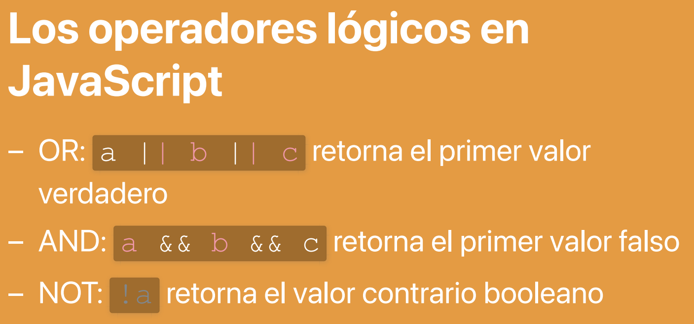
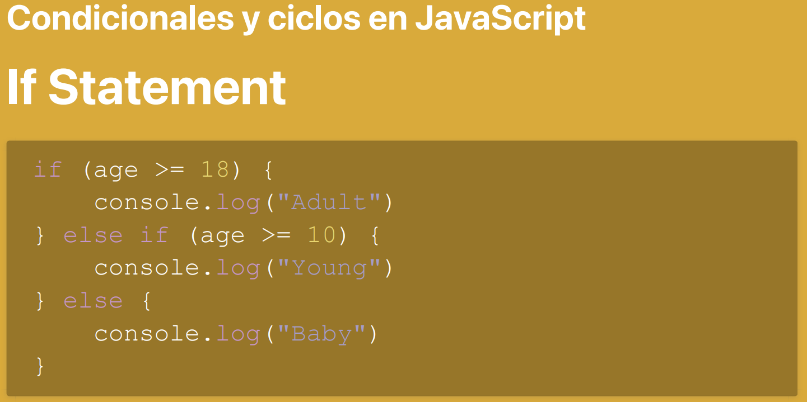
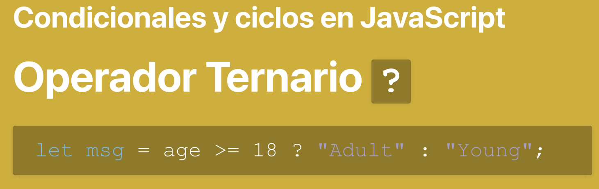
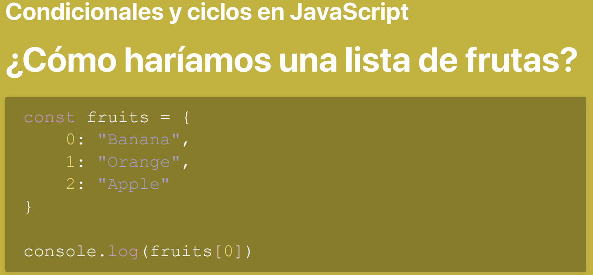
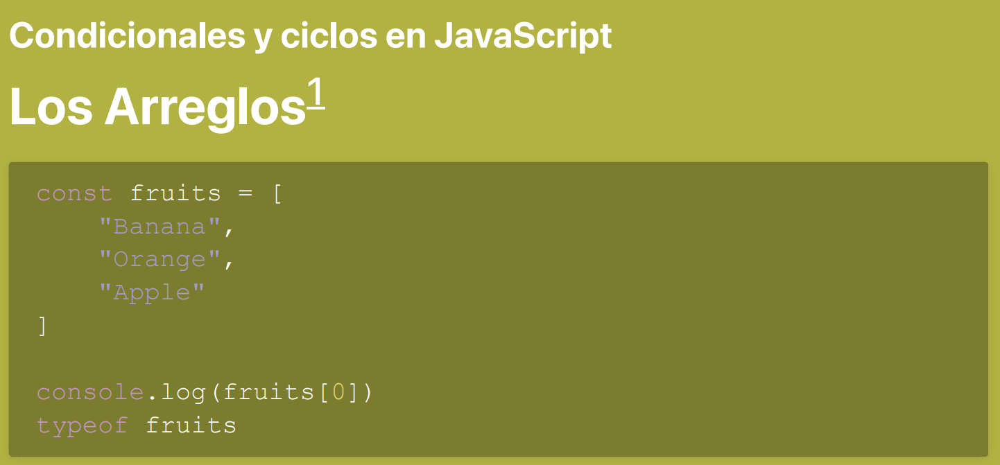
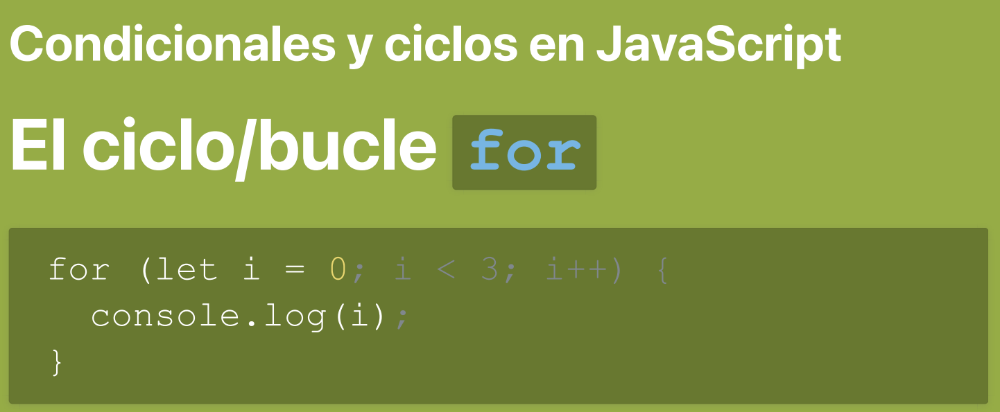

# Objetos y sus Propiedades en Javascript

```javascript
const human = {
  name: "Oswaldo",
  lastname: "Alonzo",
  age: 45
}

console.log(human);
```
Los primitivos (7) solo pueden almacenar un unico valor,  los objetos se identifican por que estos llevan llaves **("{}")** y dentro llevan los que es ****clave:"valor"** y a esto se le llama **propiedades**

## imprimiendo propiedades individuales
```javascript
console.log(human.name)
```

## agregando propiedades al objeto
```javascript
human.id = Symbol("valitogt")
human.blonde = true;
console.log(typeof human.id);
```

## Se puede ascceder a las propiedades con el operador "punto" o "corchete"
```javascript
const designer = {
  name: "Juan",
  lastname: "Garces",
  "the Best Designer": true,
}

console.log(designer["name"]);
console.log(designer["the Best Designer"]);

```

## Las propiedaes se pueden cambiar en el tiempo
```javascript
human.blonde = false;
human.age = human.age - 10;

console.log(human);
```

## Podemos elimiar las propiedades con el operador "delete"
```javascript
delete human.lastname;
delete human.age;

console.log(human);

```

## Funciones puras y mutación en Javascript
### Function Statements ( Sentencia de Funcion / Declaración)
```javascript
function walk() {
  console.log("I'm walking");
}

walk();
```

### Function Expression (Expresión de función)
```javascript
function walkingWhithStyle() {
  console.log("I'm walking");
}

walkingWhithStyle();
```

_**Las funciones en Javascript son ciudadanos de primera clase, esto quiere decir que las funciones pueden ser almacenadas como variables!**_

## Funciones puras
1. No tiene efectos secundarios: No modifica ningún estado fduera de su alcance, como variables globales o referencias
2. es determinista: Esto significa que dada la misma entrada, siempre producirá la misma salida

```javascript
function sum(x, y) {
  return x + y;
}

console.log(sum(2, 1));

```
 **x** y **y** son los _**parámetros**_ de la función mientras que en la ejecucion **2** y **1** pasan a ser los _**Argumentos**_

### Copiar valor y copiar referencia
```javascript
let name = "Oswaldo";
let nickname = "valitogt";
name = "William"

console.log(name)
console.log(nickname)

let alien = earthBorn;
alien.name = " nhojano";

console.log(earthBorn);
console.log(alien)
```

**Los objetos siempre se copian por referencia**

## función impura
```javascript

function changeName(person, newName) {
  person.name = newName;
  return person;
};

changeName(human, "Wilhelm")

changeName(human, "Wilhelm")
const peopleInSingular = changeName(human, "Pedro");


console.log(peopleInSingular)
console.log(human);

```
En este caso es impura ya que modifica el valor de referencia (human)

### Cómo hacer una copia de un objeto de manera pura


### Los operadores lógicos en Javascript













```javascript
let fruit = ["manzana", "pera", "banana"];

for (let i = 0; i < 3; i++) {
  console.log(fruit[i]);
}
console.log(fruit.length);
```


### el alcance en javascript
```javascript
let msg = "hello world";
let planet = "mars"

function scope() {
  let msg = "Olá mundo!";
  let planet = "earth";
  console.log(msg);
  if (msg) {
    let msg = "hola Mundo";
    console.log(msg, planet)
  }

  msg = "hej världen";
  console.log(msg);
}

console.log(scope());
console.log(msg);
console.log(planet);
```
